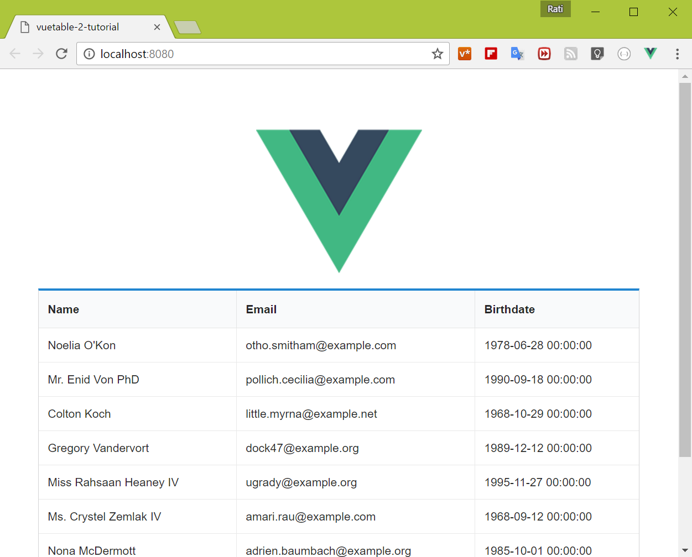

# 1) Your first Vuetable

* install vuetable-2 using yarn

    ```shell
    $ yarn add vuetable-2
    ```

+ Create MyVuetable component (`src\components\MyVuetable.vue`)

    ```vue
    // MyVuetable.vue

    <template>
      <vuetable ref="vuetable"
        api-url="http://vuetable.ratiw.net/api/users"
        :fields="['name', 'email', 'birthdate']"
      ></vuetable>
    </template>

    <script>
    import Vuetable from 'vuetable-2/src/components/Vuetable'

    export default {
      components: {
        Vuetable
      }
    }
    </script>
    ```

+ Modify `index.html` to include [JQuery] and [Semantic UI]
+
    ```html
    <!DOCTYPE html>
    <html>
      <head>
        <meta charset="utf-8">
        <title>vuetable-2-tutorial</title>
        <link rel="stylesheet" href="https://cdnjs.cloudflare.com/ajax/libs/semantic-ui/2.2.7/semantic.min.css" media="screen" title="no title" charset="utf-8">
      </head>
      <body>
        <div id="app"></div>
        <!-- built files will be auto injected -->

         <script src="https://cdnjs.cloudflare.com/ajax/libs/jquery/3.1.0/jquery.min.js" charset="utf-8"></script>
        <script src="https://cdnjs.cloudflare.com/ajax/libs/semantic-ui/2.2.7/semantic.min.js" charset="utf-8"></script>
      </body>
    </html>
    ```

+ Modify `App.vue` to use `MyVuetable` component instead of `Hello` component

    ```html
    <template>
      <div id="app">
        
        <div class="ui container">
          <my-vuetable></my-vuetable>
        </div>
      </div>
    </template>

    <script>
    import MyVuetable from './components/MyVuetable'

    export default {
      name: 'app',
      components: {
        MyVuetable
      }
    }
    </script>

    <style>
    #app {
      font-family: 'Avenir', Helvetica, Arial, sans-serif;
      -webkit-font-smoothing: antialiased;
      -moz-osx-font-smoothing: grayscale;
      text-align: center;
      color: #2c3e50;
      margin-top: 60px;
    }
    </style>
    ```

* Run the project to see the changes`
    ```shell
    $ yarn run dev
    ```

    you should see something like this

    

### Congratulations!

You've now successfully created your first component using Vuetable.

[Source code for this lesson](https://github.com/ratiw/vuetable-2-tutorial/tree/lesson-1)
