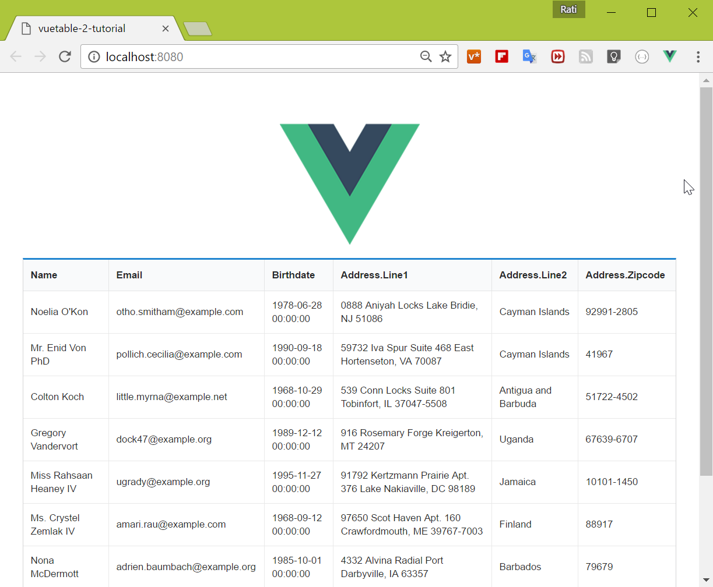

# 2) Displaying more fields

## Add more fields to MyVuetable
Looking at the sameple data from the API, we have more information that we could display especially the data in the `address` object. 

Let's see how we can display those nested data

* add `address.line1`, `address.line2`, `address.zipcode` in `MyVuetable.vue`

    ```vue
    // MyVuetable.vue

    <template>
      <vuetable ref="vuetable"
        api-url="http://vuetable.ratiw.net/api/users"
        :fields="['name', 'email', 'birthdate', 'address.line1', 'address.line2', 'address.zipcode']"
      ></vuetable>
    </template>

    <script>
    import Vuetable from 'vuetable-2/src/components/Vuetable'

    export default {
      components: {
        Vuetable
      }
    }
    </script>
    ```

* run the project

    ```shell
      $ yarn run dev
    ```

    You should now see the additional fields showing in our Vuetable
    

[Source code for this lesson](https://github.com/ratiw/vuetable-2-tutorial/tree/lesson-2)
