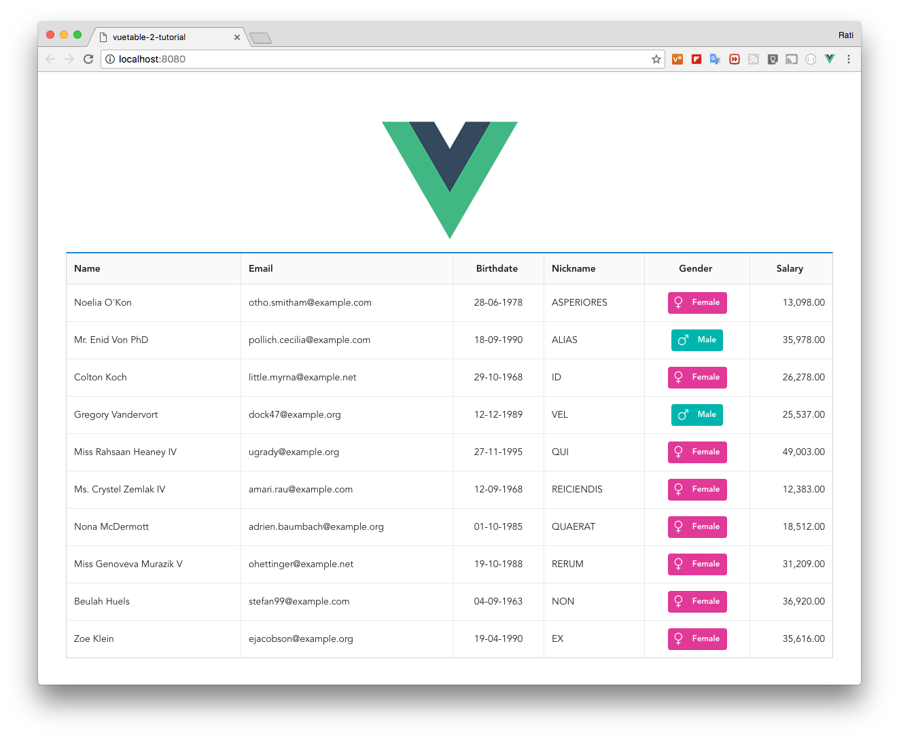

# 6) Format fields using `callback` option

In this lesson, we will use `callback` option of Vuetable to format the following fields

* `nickname` -- display in all upppercase letters
* `gender` -- display `Male` or `Female` as colored label with an icon
* `salary` -- using [accounting.js](http://openexchangerates.github.io/accounting.js) to display the value with thousand separator
* `birthdate` -- using [moment.js](https://momentjs.com/) to display different date format

The `callback` option allows us to specify the callback function for a specific field to handle the value of the column data to be displayed. Vuetable will use the returned value of the callback to display the data in that column.

## `nickname` field
Let's begin with displaying `nickname` in all upppercase.

```javascript
  // MyVuetable.vue

  //...
  data () {
    return {
      fields: [
        //...
        {
          name: 'nickname',
          callback: 'allcap'
        },
        //...
      ]
    }
  },
  methods: {
    allcap (value) {
      return value.toUpperCase()
    }
  }
```

The `callback` option of `nickname` field specifies that the value of `nickname` should be handle by the callback function named `allcap` defined in this component/instance.

So, we then define the `allcap` function in the `methods` block of the component. The `callback` function will recieved 2 parameters from Vuetable, which are

* the `value` of the column data in the current row
* and, additional parameter string

In this case, we only use the first parameter (`value`). We will see the use of the second parameter later when we create a callback function for `birthdate` field.

## `gender` field
Now, we will make use of the CSS framework to format the gender field to display the icon label.

```javascript
  // MyVuetable.vue

  //...
  data () {
    return {
      fields: [
        //..
        {
          name: 'gender',
          titleClass: 'center aligned',
          dataClass: 'center aligned',
          callback: 'genderLabel'
        },
        //..
      ]
    }
  },
  methods: {
    //...
    genderLabel (value) {
      return value === 'M'
        ? '<span class="ui teal label"><i class="large man icon"></i>Male</span>'
        : '<span class="ui pink label"><i class="large woman icon"></i>Female</span>'
    }
  }
```

As you can see, returned value of the callback function can also be a valid HTML. So, you can freely use any CSS framework that you like to style it.

Here is example of using Bootstrap 3:

```javascript
  //...
  genderLabel (value) {
    return value == 'M'
      ? '<span class="label label-info"><i class="glyphicon glyphicon-star"></i> Male</span>'
      : '<span class="label label-success"><i class="glyphicon glyphicon-heart"></i> Female</span>'
  }
```

## `salary` field
To format the `salary` field, we will use `formatNumber` function of [`accounting.js`](http://openexchangerates.github.io/accounting.js/) library to do the job.

First let's include the `accounting.js` using `yarn`
```shell
    $ yarn add accounting
```

> We are using original accounting.js library, which is named `accounting`. There are other similar packages, you can pick the one the you like.


Now, we have to import it into MyVuetable before we can use it.
```javascript
  // MyVuetable.vue

  <script>
  import Vuetable from 'vuetable-2/src/components/Vuetable'
  import accounting from 'accounting'

  export default {
      //...
  }
  </script>
```

Add the `callback` option to `salary` field definition
```javascript
  // MyVuetable.vue

  data () {
    return {
      fields: [
        //...
        {
            name: 'salary',
            titleClass: 'center aligned',
            dataClass: 'right aligned',
            callback: 'formatNumber'
        },
        //...
      ]
    }
  },
```

Then, define `formatNumber` function in the `methods` block
```javascript
  // MyVuetable.vue

  //...
  methods: {
    //...
    formatNumber (value) {
        return accounting.formatNumber(value, 2)
    }
  }
```

## `birthdate` field
To format date, we will use [`momentjs`](https://momentjs.com/) to do this.

We have to include `momentjs` library first using `yarn`
```shell
$ yarn add moment
```
> The NPM package for `momentjs` is named `moment`

Let's import the `momentjs` to be use inside the MyVuetable.vue.
```javascript
  // MyVuetable.vue

  <script>
  import Vuetable from 'vuetable-2/src/components/Vuetable'
  import accounting from 'accounting'
  import moment from 'moment'

  export default {
    //...
  }
  </script>
```

Add the `callback` option to `birthdate` fiel definition
```javascript
  // MyVuetable.vue

  data () {
    return {
      fields: [
        //...
        {
            name: 'birthdate',
            titleClass: 'center aligned',
            dataClass: 'center aligned',
            callback: 'formatDate|DD-MM-YYYY'
        },
        //...
      ]
    }
  }
```

And, define `formatDate` function in the `methods` block
```javascript
  // MyVuetable.vue

  //...
  methods: {
    //...
    formatDate (value, fmt = 'D MMM YYYY') {
      return (value == null)
        ? ''
        : moment(value, 'YYYY-MM-DD').format(fmt)
    }
  }
```



[Source code for this lesson](https://github.com/ratiw/vuetable-2-tutorial/tree/lesson-6)
