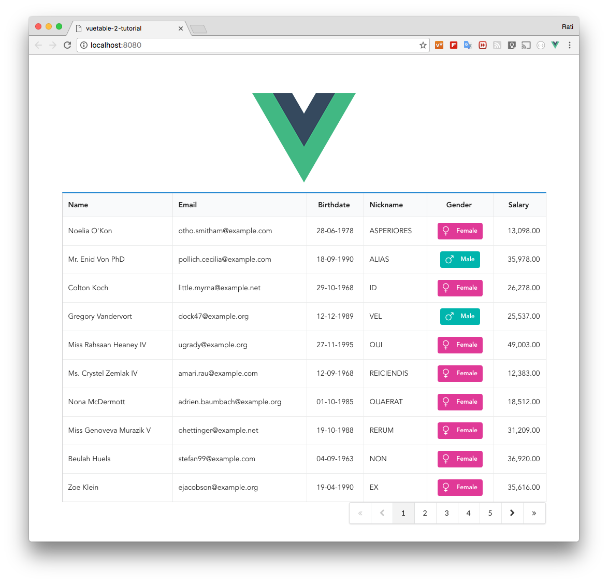

# 7) Adding pagination

So far, we have just only display the first page of data. In this lesson, we'll add table pagination to our Vuetable.

### Pagination components
Vuetable already have two ready-to-use pagination components, [`VuetablePagination`](https://github.com/ratiw/vuetable-2/blob/master/src/components/VuetablePagination.vue) and [`VuetablePaginationDropdown`](https://github.com/ratiw/vuetable-2/blob/master/src/components/VuetablePaginationDropdown.vue).

These two pagination components are only different in the appearance. Most of the functionality are the same because they both use [`VuetablePaginationMixin`](https://github.com/ratiw/vuetable-2/blob/master/src/components/VuetablePaginationMixin.vue) mixin, which provides pagination related functions.

That means you can also write your own pagination component with ease by just providing the template that uses available functions in the mixin.

> In the [first version](https://github.com/ratiw/vue-table) of Vuetable, pagination is part of the Vuetable template. This makes it easy to begin with, but this makes it inflexible if you want to customize it. That's why the pagination component is not part of the Vuetable-2 by default.

Now, let's put the pagination component in our MyVuetable template.

```vue
  // MyVuetable.vue

  <template>
    <vuetable ref="vuetable"
      api-url="http://vuetable.ratiw.net/api/users"
      :fields="fields"
    ></vuetable>
    <vuetable-pagination ref="pagination"></vuetable-pagination>
  </template>

  <script>
  import accounting from 'accounting'
  import moment from 'moment'
  import Vuetable from 'vuetable-2/src/components/Vuetable'
  import VuetablePagination from 'vuetable-2/src/components/VuetablePagination'

  export default {
    components: {
      Vuetable,
      VuetablePagination
    },
    //...
  }
  </script>
```

However, this won't work just yet because Vue would throw an error at you if you run it. The error would be something like this.

```shell
    template syntax error Component template should contain exactly one root element.
```

Vue now requires that your component has only one root and if it doesn't, it will throw the above error message.

To fix this, you just have to wrap those components in one HTML tag like `<div></div>` like this.
```html
  // MyVuetable.vue

  <template>
    <div>   // <---
      <vuetable ref="vuetable"
        api-url="http://vuetable.ratiw.net/api/users"
        :fields="fields"
      ></vuetable>
      <vuetable-pagination ref="pagination"></vuetable-pagination>
    </div>
  </template>
```

But if you look at the template in `App.vue`, you should see that we have `<div class="ui container>` already wrapping `my-vuetable`. So, it's better that we make use of this.

So, let's modify the template in `App.vue` to look like this.
```html
  // App.vue

  <template>
    <div id="app">
      
      <my-vuetable></my-vuetable>
    </div>
  </template>
```

And, modify the template in `MyVuetable.vue` to look like this.
```html
  // MyVuetable.vue

  <template>
    <div class="ui container">
      <vuetable ref="vuetable"
        api-url="http://vuetable.ratiw.net/api/users"
        :fields="fields"
      ></vuetable>
      <vuetable-pagination ref="pagination"></vuetable-pagination>
    </div>
  </template>
```

You can run the project now and see that the error is gone, but you won't see the pagination component just yet.

This is because in order for it to work, we will need to **bind it** with Vuetable component and we'll do that in later section. Next, we will have to discuss about the pagination data structure.

### Pagination data structure

In order for the pagination component to work correctly, it needs some information to properly display the pagination navigation buttons and keeps track of the current position of the page.

This information must be included as part of the data structure returned from the `api-url` prop and you need to tell Vuetable where it is in that data structure.

The same [API endpoint](http://vuetable.ratiw.net/api/users) that we use in this tutorial already has this information. Let's have a look.
```json
{
  "total": 200,
  "per_page": 15,
  "current_page": 1,
  "last_page": 14,
  "next_page_url": "http://vuetable.ratiw.net/api/users?page=2",
  "prev_page_url": null,
  "from": 1,
  "to": 15,
  "data": [
    {...},
    {...}
    //...
  ]
}
```

The above JSON data structure is taken from [Laravel's pagination](https://laravel.com/docs/5.3/pagination#converting-results-to-json).

The pagination information that Vuetable uses are
- `total` -- total number of records available
- `per_page` -- the number of records returned in this request/page
- `current_page` -- the current page of this data chunck
- `last_page` -- the last page of this data
- `next_page_url` -- URL of the next page
- `prev_page_url` -- URL of the previous page
- `from` -- the start record of this page
- `to` -- the end record of this page

Without those information, Vuetable's pagination component will not work.

> If you are using the API from the service provider that has different data structure or using different variable names, you will have to use [`transform()`]() hook to transform the data structure you received to the one that Vuetable can work with.

### Pagination path

If you run the project and happen to open the inspection console of the browser, you would notice a warning like this
```
vuetable: pagination-path "links.pagination" not found. It looks like the data
returned from the server does not have pagination information or you may have
set it incorrectly.
```

Vuetable will look for the pagination information in the returned data at the specific location and by default that location is `links.pagination`
```json
{
  links: {
    pagination: {
      // pagination information
    }
  },
  data: [
    {...},
    //...
  ]
}
```

But the data we received from the API endpoint in this tutorial, the pagination information that we need is at the root of the data structure. So, we need to tell Vuetable about this by setting the `pagination-path` prop to the root of the data structure. That is `pagination-path=""`. Now our template in `MyVuetable.vue` should look like this.
```html
  // MyVuetable.vue

  <template>
    <div class="ui container"
      <vuetable ref="vuetable"
        api-url="http://vuetable.ratiw.net/api/users"
        :fields="fields"
        pagination-path=""    // <----
      ></vuetable>
      <vuetable-pagination ref="pagination"></vuetable-pagination>
    </div>
  </template>
  //...
```

### Binding pagination component

Now, we are ready to bind VuetablePagination to Vuetable so that it receives pagination information that it can use. We do this in 3 steps:

- listen to `vuetable:pagination-data` event on Vuetable and specify the  binding handler function.
- listen to `vuetable-pagination:change-page` event on VuetablePagination and specify the binding handler function.
- define both of the binding handler functions in our component.

#### # listen to `vuetable:pagination-data` event

Vuetable emits many events during its life cycle, one of them is `vuetable:pagination-data`.

> All of the event emitted by Vuetable always has `vuetable:` prefix.

Whenever Vuetable received data from API endpoint, it emits `vuetable:pagination-data` event containing pagination information from the data structure.

We instruct Vuetable to listen to this event using `v-on` directive. In the following code, we will use the shorthand form of `v-on` which is `@vuetable:pagination-data="onPaginationData`.

```html
  // MyVuetable.vue

  <template>
    <div class="ui container"
      <vuetable ref="vuetable"
        api-url="http://vuetable.ratiw.net/api/users"
        :fields="fields"
        pagination-path=""
        @vuetable:pagination-data="onPaginationData"  // <----
      ></vuetable>
      <vuetable-pagination ref="pagination"></vuetable-pagination>
    </div>
  </template>
  //...
```

`onPaginationData` is an event handler that we will create in the last step.

#### # listen to `vuetable-pagination:change-page` event

VuetablePagination emits only one event that is `vuetable-pagination:change-page`. This event will inform its parent component that the user has click on a pagination link and this should cause the loading of the given page for display.

> Notice the event prefix here is `vuetable-pagination:`. If you've noticed, I'm trying to make a convention here.

```html
  // MyVuetable.vue

  //...
  <vuetable-pagination ref="pagination"
    @vuetable-pagination:change-page="onChangePage"
  ></vuetable-pagination>
  //...
```


#### # define handler function

Now, let's define the handler function
```javascript
  // MyVuetable.vue

  //...
  methods: {
    //...
    onPaginationData (paginationData) {
      this.$refs.pagination.setPaginationData(paginationData)
    },
    onChangePage (page) {
      this.$refs.vuetable.changePage(page)
    }
  }
```

Once you save and run it, you should now see that pagination on the page like this.
    

> In the [first version](https://github.com/ratiw/vue-table) of Vuetable,
> the binding of pagination component is done automatically. But in order to make it customizable, e.g. pagination component both at the top and bottom of Vuetable, we have to resort to manual binding. As you can see, this is quite easy though.

Now, try changing this line:

```javascript
  // MyVuetable.vue

  //...
  import VuetablePagination from 'vuetable-2/src/components/VuetablePagination'
```

to this
```javascript
  // MyVuetable.vue

  //...
  import VuetablePagination from 'vuetable-2/src/components/VuetablePaginationDropdown'
```


[Source code for this lesson](https://github.com/ratiw/vuetable-2-tutorial/tree/lesson-7)
