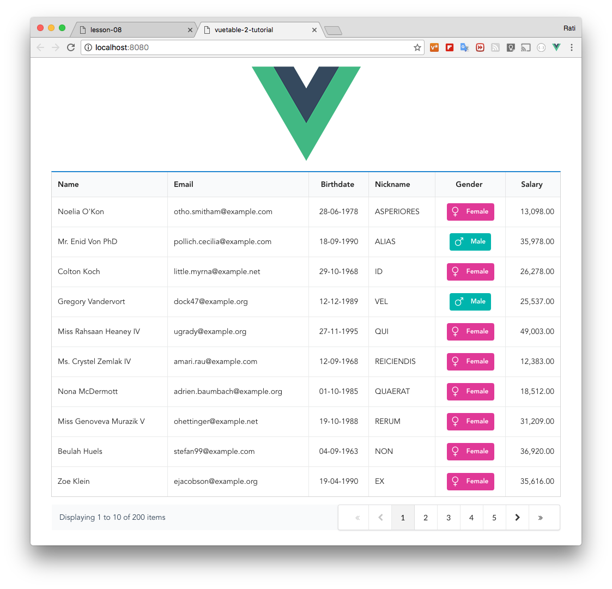

# 8) Displaying pagination information

In this lesson, we are going to add a component to display pagination information showing the number of records currently displaying and how many records are available.

Vuetable also comes with pagination information component called [`VuetablePaginationInfo`](https://github.com/ratiw/vuetable-2/blob/master/src/components/VuetablePaginationInfo.vue) out of the box. We can import and bind it via `onPaginationData()` event handler.

Let's see the code.

```vue
  // MyVuetable.vue

  <template>
    //...
    <vuetable ref="vuetable"
      //...
    ></vuetable>
    <div class="vuetable-pagination ui basic segment grid">
      <vuetable-pagination-info ref="paginationInfo"      // <----
      ></vuetable-pagination-info>

      <vuetable-pagination ref="pagination"
        @vuetable-pagination:change-page="onChangePage"
      ></vuetable-pagination>
    </div>
    //...
  </template>

  <script>
  //...
  import VuetablePaginationInfo from 'vuetable-2/src/components/VuetablePaginationInfo'

  export default {
    components: {
      Vuetable,
      VuetablePagination,
      VuetablePaginationInfo    // <----
    },
    data () {
      //...
    },
    methods: {
      //...
      onPaginationData (paginationData) {
        this.$refs.pagination.setPaginationData(paginationData)
        this.$refs.paginationInfo.setPaginationData(paginationData)   // <----
      },
      //...
    }
  </script>
```

VuetablePaginationInfo also need to use the pagination information for display. In this case, we already have the handler for `vuetable:pagination-data` defined, so we can just add another line to `onPaginationData()`.

You should notice that we are now wrapping both VuetablePagination and VuetablePaginationInfo inside another `<div>`, so it's easier to style it using CSS.

And here's how it should look now.
    

[Source code for this lesson](https://github.com/ratiw/vuetable-2-tutorial/tree/lesson-8)
