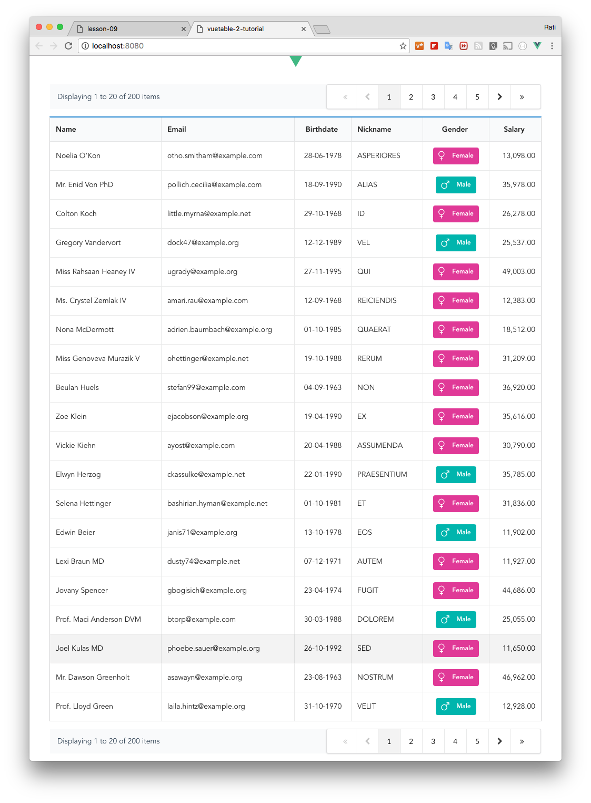

# 9) Customizing Vuetable

In this lesson, we will make some customizations to MyVuetable.

## Displaying more records per page

By default, Vuetable only request 10 records per page for displaying, but you can easily change it by specifying the number of records needed via `per-page` prop.

```html
  // MyVuetable.vue

  <template>
    //...
      <vuetable ref="vuetable"
        //..
        :per-page="20"    // <----
        @vuetable:pagination-data="onPaginationData"
      ></vuetable>
    //...
  </template>
```

## Adding pagination at the top

Now, we are displaying 20 records per page which is quite lengthy and a bit harder to move through pages because the pagination navigation is at the bottom.

Let's add another one at the top by copying the pagination that we have at the bottom, put it just before `<vuetable>` tag, and rename the `ref` as `paginationInfoTop` like so.

```html
  // MyVuetable.vue

  <template>
    //...
      <div class="vuetable-pagination ui basic segment grid">
        <vuetable-pagination-info ref="paginationInfoTop"
        ></vuetable-pagination-info>
        <vuetable-pagination ref="paginationTop"
          @vuetable-pagination:change-page="onChangePage"
        ></vuetable-pagination>
      </div>
      <vuetable ref="vuetable"
        //..
      ></vuetable>
    //...
  </template>
```

And this new pagination component still needs to listen to `vuetable-pagination:change-page` as well, but it can just point to the existing `onChangePage()` event handler.

Then, we only need to make a little change to `onPaginationData()` function.
```javascript
  // MyVuetable.vue

  //...
  onPaginationData (paginationData) {
    this.$refs.paginationTop.setPaginationData(paginationData)      // <----
    this.$refs.paginationInfoTop.setPaginationData(paginationData)  // <----

    this.$refs.pagination.setPaginationData(paginationData)
    this.$refs.paginationInfo.setPaginationData(paginationData)
  },
  //...
```

Run the project and you should now see the pagination at the top of the table and working the same as the bottom one as well.

  

## Showing/hiding columns

Let's say for some reasons, you want to hide the `salary` column, how could we do that. With Vuetable, this is very easy.

Remember the field definition options? There is another option called `visible` which when set to `false`, that column will be hidden.
```javascript
  // MyVuetable.vue

  //...
  data () {
    return {
      fields: [
        //...
        {
          name: 'salary',
          titleClass: 'center aligned',
          dataClass: 'right aligned',
          callback: 'formatNumber',
          visible: false
        }
      ]
    }
}
```

Try it!

[Source code for this lesson](https://github.com/ratiw/vuetable-2-tutorial/tree/lesson-9)
