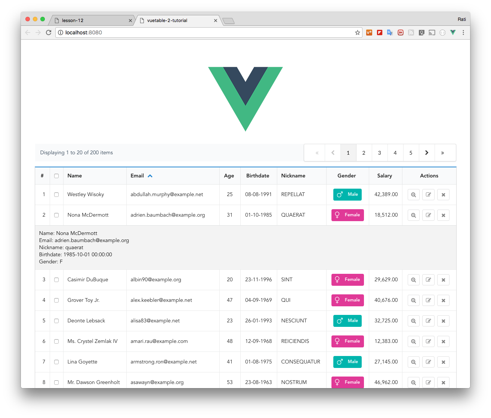

# 12) Adding Detail Row

Detail row is additional row hidden underneath each data row in the table. You can use it to reveal more data when needed instead of trying to display everything on a single row.

In this section, we will make a detail row component and add it to our Vuetable.

First, let's create `src\components\DetailRow.vue`

```vue
  // DetailRow.vue
  <template>
    <div @click="onClick">
      <div class="inline field">
        <label>Name: </label>
        <span>{{rowData.name}}</span>
      </div>
      <div class="inline field">
        <label>Email: </label>
        <span>{{rowData.email}}</span>
      </div>
      <div class="inline field">
        <label>Nickname: </label>
        <span>{{rowData.nickname}}</span>
      </div>
      <div class="inline field">
        <label>Birthdate: </label>
        <span>{{rowData.birthdate}}</span>
      </div>
      <div class="inline field">
        <label>Gender: </label>
        <span>{{rowData.gender}}</span>
      </div>
    </div>
  </template>

  <script>
  export default {
    props: {
      rowData: {
        type: Object,
        required: true
      },
      rowIndex: {
        type: Number
      }
    },
    methods: {
      onClick (event) {
        console.log('my-detail-row: on-click', event.target)
      }
    },
  }
  </script>
```

Now, you can tell Vuetable to use our detail row component via `detail-row-component` prop using the **name** you register the detail row component with Vue.

```javascript
  // MyVuetable.vue
  <template>
    //...
    <vuetable ref="vuetable"
      //...
      detail-row-component="my-detail-row"    // <--- specify the component
      @vuetable:cell-clicked="onCellClicked"  // <--- listen to event and bind to handler
      //...
    ></vuetable>
    //...
  </template>
  <script>
    //...
    import DetailRow from './DetailRow'

    Vue.component('my-detail-row', DetailRow)   // <--- register the component to Vue
    //...

  </script>
```

Notice that we also bind `@vuetable:cell-clicked` to the `onCellClicked` method. In this method, we will call `toggleDetailRow()` to actually toggle the display state of our detail row component. Here's the code.

```javascript
  // MyVuetable.vue

  //...
  export default {
    //...
    methods: {
      //...
      onCellClicked (data, field, event) {
        console.log('cellClicked: ', field.name)
        this.$refs.vuetable.toggleDetailRow(data.id)
      }
    }
  }
```

Please also note that we also pass the `id` of current data to `toggleDetailRow` so that Vuetable can keep track of each detail row state, just like what we did with `__checkbox`.

> By default, Vuetable uses `id` column to track the display state of each detail row. If your data does not have `id` column or you use different column, you have to tell Vuetable to use that column via `track-by` prop.



[Source code for this lesson](https://github.com/ratiw/vuetable-2-tutorial/tree/lesson-12)
