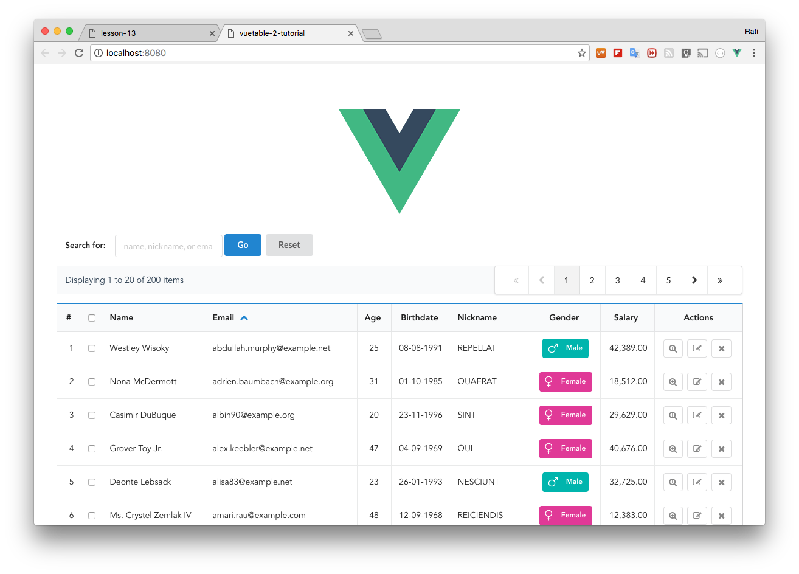
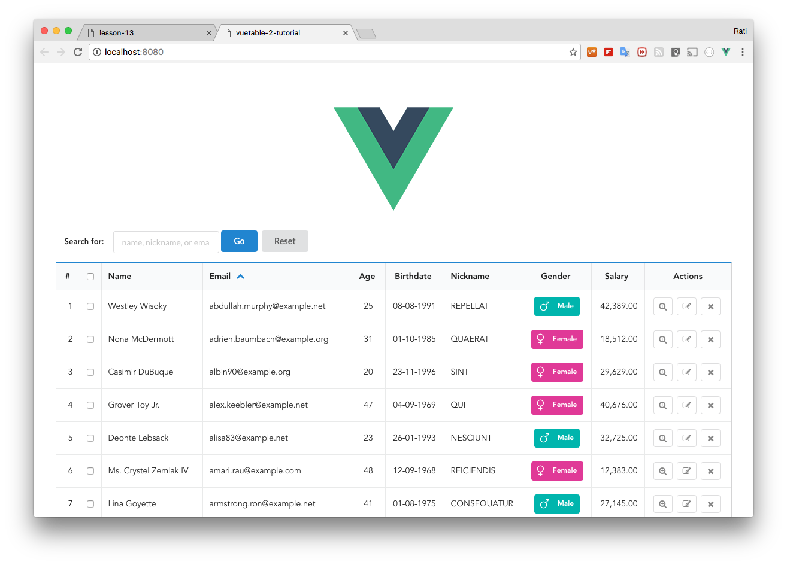
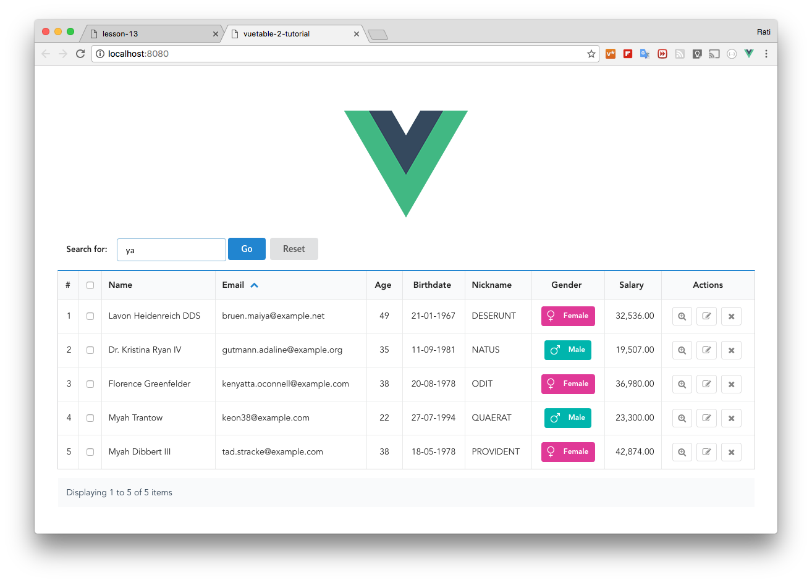

# 13) Adding Search Filter

In this lesson, we will add the search bar to send the filter query to our API endpoint.

## Create a filter bar component

Let's begin by creating a new file to and place the following code in there. Save and name it `src\components\FilterBar.vue`

```vue
  // FilterBar.vue

  <template>
    <div class="filter-bar ui basic segment grid">
      <div class="ui form">
        <div class="inline field">
          <label>Search for:</label>
          <input type="text" v-model="filterText" class="three wide column" @keyup.enter="doFilter" placeholder="name, nickname, or email">
          <button class="ui primary button" @click="doFilter">Go</button>
          <button class="ui button" @click="resetFilter">Reset</button>
        </div>
      </div>
    </div>
  </template>

  <script>
  export default {
    data () {
      return {
        filterText: ''
      }
    },
    methods: {
      doFilter () {
        console.log('doFilter:', this.filterText)
      },
      resetFilter () {
        this.filterText = ''
        console.log('resetFilter')
      }
    }
  }
</script>
```

The `FilterBar` component contains one text input for the user to enter the filter text, and two buttons; one to set the filter, and another to reset the filter. We also use `@keyup.enter` to immediately apply the filter when the user presses the Enter key in the text input.

But, as usual, in order for it to work, we have to import it and put it in our main template `MyVuetable` first. Let's do that now.

```vue
  // MyVuetable.vue

  <template>
    <div class="ui container">
      <filter-bar></filter-bar>   // <----
      <vuetable ref="vuetable"
      //...
    </div>
  </template>

  <script>
  //...
  import FilterBar from './FilterBar'

  Vue.component('filter-bar', FilterBar)
  //...
  </script>
```

Now you should be able to run the project. Try entering something in the text input of `FilterBar`, and also clicking on those two buttons and see the output in the console window of the browser.

At the moment, the `FilterBar` does not do anything much, just logging out a message to the console to prove that it does work.



## Removing PaginationInfoTop

Right now our `FilterBar` looks a bit odd on top of the top pagination. As it already serve its purpose, we should now remove it out and make our `FilterBar` looks a little nicer.

Remove the following line from our MyVuetable template, so that the `<filter-bar></filter-bar>` tag now is next to the `<vuetable ref="vuetable"` line.

```html
    <vuetable-pagination-info ref="paginationInfoTop"
    ></vuetable-pagination-info>
    <vuetable-pagination ref="paginationTop"
      @vuetable-pagination:change-page="onChangePage"
    ></vuetable-pagination>
```

We also have to remove any reference to the `paginationInfoTop` in our code.

In the `onPaginationData` methods, remove the following lines

```javascript
    this.$refs.paginationTop.setPaginationData(paginationData)
    this.$refs.paginationInfoTop.setPaginationData(paginationData)
```

The top pagination should now be removed.



Next, we will modify `FilterBar` so that when the user click the "Go" button or press Enter in the text input to apply the filter, we will fire an event to notify other components that the user has just set the filter.

We will also do the same for "Reset" button by firing an event to notify the others that the user has decided to reset the filter.

## Using centralized event hub

We used to have event broadcasting/dispatching mechanism in Vue 1.x, but it has its limitation when the application grows more complex. So in Vue 2.x, the old event mechanism has been deprecated and we are encouraged to use centralized event hub or state management system like Vuex instead.

For us, Vuex is a bit complex for a simple project, so we will instead use the centralized event hub. But you should be able to adapt it to Vuex as well if you wish.

In this lesson, we will not create our own centralized event hub. But we will use another Vue plugin instead and it is called `vue-events` and you can find more information about it and how to install it via `npm` in its [GitHub repo here](https://github.com/cklmercer/vue-events/tree/vue-2.x).

Now, let's use it in our component. Add the following code to `MyVuetable.vue` to import and register it with Vue.

```javascript
  // MyVuetable.vue

  //...
  import Vue from 'vue'
  import VueEvents from 'vue-events'
  Vue.use(VueEvents)
  //...
```

> `vue-events` is a Vue.js plugin, so we have to import and register it with Vue.js via `Vue.use()`. And since we have to reference `Vue`, we have to import it as well and that's what the first line is for.

Once we have registered `vue-events` with Vue, we will now have `$events` prototype object in our Vue instance. This `$events` object is the centralized event hub that we can use throughout our Vue instance and it provides event related functions for use to use. Read more about it [here](https://github.com/cklmercer/vue-events/tree/vue-2.x#usage).

Furthermore, it will also allow us to register the event listeners to the `events` option, just like in Vue 1.x.

Let's modify our `FilterBar` component to fire the `filter-set` and `filter-reset` events.

```javascript
  // FilterBar.vue

  //...
  methods: {
    doFilter () {
      this.$events.fire('filter-set', this.filterText)
    },
    resetFilter () {
      this.filterText = ''  // clear the text in text input
      this.$events.fire('filter-reset')
    }
  }
```

Then, let's register the event listeners in `MyVuetable.vue` to handle those filter events. With the help of `vue-events`.

```javascript
  // MyVuetable.vue

  //...
  mounted() {
    this.$events.$on('filter-set', eventData => this.onFilterSet(eventData))
    this.$events.$on('filter-reset', e => this.onFilterReset())
  },
  methods: {
    //...
    onFilterSet (filterText) {
      console.log('filter-set', filterText)
    },
    onFilterReset () {
      console.log('filter-reset')
    }
  }
```

Run the project and try it. It will demonstrate the use of `vue-events`, but our work is not finish yet as we haven't send the filter text to the API endpoint.

## Using `append-params` to send filter text

First, please note that **Vuetable does not filter the data by itself**. The filter functionality is done on the server side via the API endpoint. So, our job is to let Vuetable send the filter query string back to the server.

Normally, Vuetable will send the following query to the API endpoint

- number of records per page (`per_page`)
- requested page number (`page`)
- requested sort order (`sort`)

But you can send more parameters to the API by using [`append-params`](#) prop.

The `append-params` is an object containing a list of key-value pair. Anything you put in here will be converted to key-value query string and appends to the default query string.

In our case, the sample API endpoint we use provides the filter functionality via the `filter` keyword. If you want only the records that contain the word "**dan**", the `filter=dan` must be added to the query string that send to the API.

So, we will bind `append-params` prop to a new variable called `moreParams` in our MyVuetable component like this to later use it in our event listeners.

```vue
  // MyVuetable.vue

  <template>
    //...
    <vuetable ref="vuetable"
      //...
      :append-params="moreParams"   // <----
    ></vuetable>
    //...
  </template>

  <script>
    //...
    data () {
      //...
      sortOrder: [
        //...
      ],
      moreParams: {}  // <----
    },
    //...
  </script>
```

Then, we will modify our event listener to use `moreParams` to add or remove the `filter` key.

```javascript
  // MyVuetable.vue

  //...
  methods: {
    //...
    onFilterSet (filterText) {
        this.moreParams = {
            'filter': filterText
        }
        Vue.nextTick( () => this.$refs.vuetable.refresh())
    },
    onFilterReset () {
        this.moreParams = {}
        Vue.nextTick( () => this.$refs.vuetable.refresh())
    }
  }
```

Note that we call `vuetable.refresh()` inside `Vue.nextTick`. This is necessary and it tells Vue that it should wait until the reactivity has finished the update before running the callback inside `Vue.nextTick`.

> You can rewrite the `Vue.nextTick` line like this instead
> ```
>   vm = this
>   Vue.nextTick( function() {
>     vm.$refs.vuetable.refresh()
>   })
> ```

Run the project and try it. The filter functionality should now work.



# That's wrap!

And that's it for our tutorial! We hope you've learn enough of Vuetable, so that you can successfully use it in your project.

If you like Vuetable and think it does save you some time and works, please consider supporting me using this [PayPal](https://www.paypal.me/ratiw) link. I usually use it to buy ebooks or online courses to expand my knowledge. Thanks!

[Source code for this lesson](https://github.com/ratiw/vuetable-2-tutorial/tree/lesson-13)
